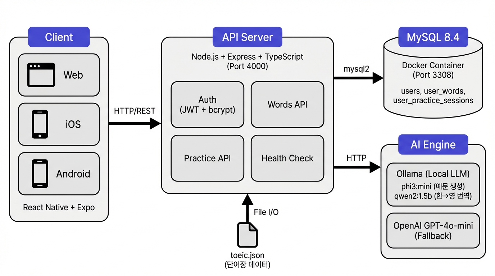

# TOEIC 단어 학습 앱

> 하루 3~50개 단어를 학습하는 미니멀 영어 학습 앱

---

## 프로젝트 구조

```
toeic/
├── api/                  # 백엔드 (Node.js + Express + TypeScript)
│   └── src/
│       ├── index.ts      # Express 서버, 인증, API 라우팅
│       ├── voca.ts       # 단어장 로드 및 랜덤 선택
│       └── wordPractice.ts  # AI 예문 생성 (Ollama / OpenAI)
├── app/                  # 프론트엔드 (React Native + Expo + TypeScript)
│   ├── App.tsx           # 전체 UI (로그인, 학습, 연습, 나의 단어)
│   └── index.ts          # Expo 앱 진입점
├── toeic.json            # TOEIC 단어장 데이터
└── docs/
    └── architecture.png  # 서버 아키텍처 다이어그램
```

---

## 아키텍처



---

## 기술 스택

| 구분 | 기술 |
|------|------|
| **프론트엔드** | React Native + Expo + TypeScript |
| **백엔드** | Node.js + Express + TypeScript |
| **데이터베이스** | MySQL |
| **인증** | JWT (jsonwebtoken) + bcryptjs |
| **AI 예문 생성** | Ollama (phi3:mini 예문 + qwen2:1.5b 번역) |
| **AI Fallback** | OpenAI GPT-4o-mini |
| **플랫폼** | Web, iOS, Android (Expo) |

---

## 주요 기능

### 1. 단어 학습
- 학습할 단어 수를 직접 입력 (최대 50개)
- 단어 카드에서 "알겠다" / "모르겠다" 선택
- 이미 학습한 단어는 자동 제외
- TTS 발음 듣기 지원

### 2. AI 예문 연습
- 단어를 입력하면 Ollama가 10개 영어 예문 생성
- qwen2가 한국어로 번역
- 한국어를 보고 영어로 작성하는 연습 모드
- 작성 결과 저장 및 수정 가능

### 3. 나의 단어
- 학습한 단어 목록 (아는 단어 / 모르는 단어 분류)
- 연습 기록 조회 및 재작성

---

## API 엔드포인트

| Method | Endpoint | 설명 |
|--------|----------|------|
| POST | `/api/register` | 회원가입 |
| POST | `/api/login` | 로그인 |
| GET | `/api/me` | 인증된 사용자 정보 |
| GET | `/api/words/today?count=N` | 오늘 학습할 단어 (랜덤) |
| POST | `/api/words/save` | 학습 결과 저장 |
| GET | `/api/words/my` | 사용자별 학습 단어 |
| POST | `/api/word/practice` | AI 예문 생성 |
| POST | `/api/practice/save` | 예문 연습 저장 |
| PATCH | `/api/practice/:id` | 예문 연습 수정 |
| GET | `/api/practice/my` | 사용자별 연습 목록 |
| GET | `/api/health` | 서버 상태 |
| GET | `/api/health/ollama` | Ollama 연결 상태 |

---

## 실행 방법

### 사전 요구사항
- Node.js 18+
- MySQL
- Ollama (로컬 LLM, 선택)

### 1. 백엔드

```bash
cd api
cp .env.example .env    # .env 파일 수정
npm install
npm run dev             # 개발 서버 (tsx watch)
```

### 2. 프론트엔드

```bash
cd app
npm install
npm run web             # 웹 브라우저
npm run start           # Expo Go
```

### 3. Ollama (선택)

```bash
ollama serve
ollama pull phi3:mini
ollama pull qwen2:1.5b
```

---

## 데이터베이스

MySQL에 `toeic` 데이터베이스를 생성하면, 서버 시작 시 필요한 테이블이 자동 생성됩니다.

- `users` — 사용자 (별도 생성 필요)
- `user_words` — 학습 기록 (자동 생성)
- `user_practice_sessions` — 연습 기록 (자동 생성)

### users 테이블 생성

```sql
CREATE TABLE users (
  id CHAR(36) PRIMARY KEY DEFAULT (UUID()),
  email VARCHAR(255) UNIQUE NOT NULL,
  password_hash VARCHAR(255) NOT NULL,
  name VARCHAR(100),
  created_at TIMESTAMP DEFAULT CURRENT_TIMESTAMP
);
```

---

## 설계 철학

- **극단적 미니멀 UX**: 설명, 점수, 스트릭, 광고 없음
- **부담 없는 학습**: 열자마자 끝나는 경험
- **AI 활용**: 로컬 LLM으로 비용 최소화, 예문 품질 확보
- **조용한 후원 모델**: 기능 제한 없이 자발적 후원으로 운영
